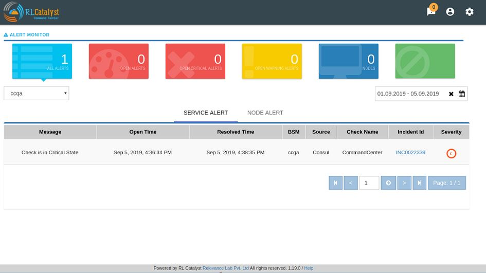
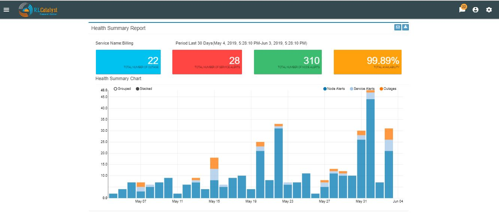
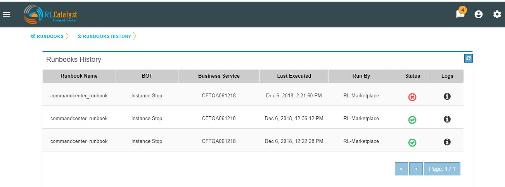

Features
========

Historical BSM Health Indicator
-------------------------------
Historical BSM Health Indicator gives you the ability to see the trend of the BSM over last 30 days as a consolidated view. Using this view, the user can then navigate to specific outage view of interest.  
  
The view can be available with a *Trend Icon* on Top-Left of BSM View and clicking that can show the Consolidated status of all BSM over last 30 days with appropriate status.  
  

Clicking the link of Outage (Red) or Partial Outage available in the Historical Status Dashboard will take the user to the appropriate Outage Drill-down page  

Viewing Cloud Assets
--------------------

From the menu at the top left of the top bar, choose CMDB. Cloud assets will be listed once the Cloud Credentials are added in Settings. From the dropdown choose the cloud account and get the summary view and list view as shown in screenshot. The CMDB lists the following:  
  1.    Virtual machines    
  2.    Disks   
  3.    Security Groups   
  4.    Network Cluster   
  5.    Compute Databases   
  6.    Load Balancers   

If the assets are tagged, the same information will be fetched into CMDB also.   
You can filter the CMDB assets view by clicking on buttons “All, Running, Monitoring “ which is available in the right corner just above the table. By default, ALL filter should be selected.  

ALL: displays all the nodes (Active & Inactive) 

Running: displays all the running nodes   

Monitoring: displays the monitoring nodes health services, Node, ELK Log Icons.  
Clicking on Services, Node & ELK Log Icons shall take the user to respective pages.

Aggregated Alerts 
-----------------

Once the services are added and agents are installed, the alerts will be aggregated from multiple monitoring sources by the respective collectors.  Alerts are currently aggregated from

  * Ping BOTs – Checks Availability of Services    
  * Consul – Monitors Services    
  * Sensu – System Monitoring
  
When the service goes down or if an Outage happens, the corresponding card on the   dashboard view will turn Red.   
When any of the dependent services has a problem related to BSM will be Yellow.  Clicking on the card will give details on linked services and the associated nodes

Click on the Alerts button to see the detailed Alerts from multiple sources (Pingbot, Consul & Sensu). Alerts aggregated by Node or Service in the Alerts Monitor screen.
 
Service alerts are shown on the Services tab of the Alert Monitor.  
    

System alerts are shown in the Nodes tab of the Alert Monitor.  

The dependent services of the Business Service and their health can be viewed under the Linked services section of the same page.    

The dependent nodes of the Business Service and their health can be viewed under the Nodes section of the same page.    

Click on the Outages tab to get a detailed list of all the outages detected by the system.   

Incident Communication
----------------------

Click on the Incident Id to open the associated ServiceNow ticket on the ServiceNow portal.  Click on the Incident Communication icon to send out communication about the incident with Root Cause Analysis & Category. 

Auto-create Incident Communications for Detection and Resolution :

System automatically creates Incident Communication for application outage detection and resolution.  

Click on the Communications tab to see a timeline of incidents

Command Center provides a feature called “Fault Table” to capture known problems related to a service and then uses the information to help the user to categorize the root-cause of any outage that occurs.  

User can add fault to “Fault Table” by clicking on + icon which is available in the “Known Faults” table (Menu->Known Faults link-> + icon)  

When a Root-cause identified incident communication is entered, the user can link the RCA Incident Communication to an item in the Fault Table associated to the BSM through Add Incident Communication screen.  

User shall be able to navigate to the Fault Table from any outage which is linked to a fault by clicking on “Fault” link in the Outages screen.  

.. image:: images/FaultsLink.jpg

User can view the count of outages linked to a fault by clicking on the “Outages Linked” link in the Fault table   

Aggregated Alerts for all services are available from the left pane menu ‘Services’.

.. image:: images/AggregatedServicesAlertsView.jpg

Aggregated Alerts for all servers/instances are available from the left pane menu ‘Monitoring Tools’

History for all servers/instances are available from the Monitoring Tools->Clients->History    

Click on History Icon, to view the detailed history information regarding each client

Logging in as a landlord
------------------------

Open a browser (we recommend Chrome or Firefox). Enter the application URL provided. The login page should open. On the login page, fill the Company, User and Password fields as captured in Appendix A. Then click the Login button. You will see the landing page of the tenant created first and by choosing the tenant be able to view the data of that tenant.

Remediation
-----------

Command Center allows you to restart the service if a problem is encountered either at an underlying Node level or at a dependent service level. This feature is to give L0/L1 level support personnel a quick means of attempting to correct a problem.   
   
When a dependent node/service has a critical alert, you have an option to remediate the problem by clicking on the icon to restart the service which is available in the BSM drilldown view screen. The BOT would then restart the node.

Auto Remediation
----------------

Command Center allows you to choose to configure certain Business Services (Managed Nodes) for auto healing. Whenever an outage is detected for a BSM configured with auto-healing, the system shall then kick-off the auto-remediation process. Auto-healing shall be initiated for nodes provided are in warning or critical status.
  
Manual remediation shall not be available for Nodes under a BSM that is enabled for Auto-healing.  
  
You can opt for Auto-healing option by checking the Checkbox “Enable Auto-Remediation” which is available in the “Add Service” screen.

Planned versus Unplanned outages
--------------------------------

The idea of this feature is to provide a capability to plan a down-time so that the availability of the Business Service shall not be affected. CommandCenter has provided a screen to enter a planned outage. This screen shall take a date-time range, the nodes that are affected and the BSMs that are affected.  
When an outage occurs, check if the outage falls within a planned outage window. If yes, do not consider that outage in the availability calculations.  
  
By clicking on link “Plan Outage” which is available under the menu, application will open “Planned Outage Details “screen. By clicking on + icon you can add Plan outage for the required service.  

Contact Person
--------------

In an operations center which is using a tool like Command Center, one of the first pieces of information required when a problem is detected is the contact person designated for that Business Service. The idea of this feature is to ensure that Command Center provides an easy way to enter and display this information.

In the Settings screen, provided one more tab called Contact Details.In this screen, we can add Contact Details for each BSM.

On the Dashboard screen, each BSM card should show a ContactDetails icon. Clicking this icon should present the Contact details for that BSM in a pop-up screen.

Impact Tree
-----------

Impact tree provides a quick way to view the quick glance where in the topology the problem is.

On the main Dashboard view, if a BSM card appears yellow, the user should be able to click on an icon that shows at a quick glance pop-up.This pop-up should show a tree-view with the BSM at the top, with the Nodes under it and the services under the nodes.Based on the alerts each level will be marked with a Yellow or Red highlight.

Outage Summary Report
---------------------

Outage Summary Report will facilitate an operation manager what outages were faced,planned deployments and what early warning was provided by the tool.A report that can be run for different time-periods and which lists the outages and alerts shall be provided.

A new item called “Reports” be added to the application-menu (top-left).

Clicking on the “Reports” menu item shall lead the user to a screen where he can choose the report to run.

On choosing the report to run from a drop-down menu, the user shall be displayed the input fields which are specific to that report.On choosing “Outage Summary Report” the following input items shall be displayed.
 BSM: This will be a drop-down that allows a specific BSM item that will run the report under the logged in tenant.

 Time-period: This will be a drop-down box that allows the user to choose the time-period. Available choices shall be

  This day: Will mean the time-period from 12:00am of the current date to now.
  This week: Will mean the time-priod from 12:00am of Monday of the current week to now
  This month: Will mean the time-period from 12:00am of 1st of the current month to now
  Last 24 hours: will mean 24 hour period from current time.
  Last 7 days: will mean 24*7 hour period from current time.
  Last 30 days: will mean 30*24 hour period from current time.
 

Based on BSM Selection & Duration filter selection,outage summary report shall be generate with the two buttons "Download report as PDF" and "E-mail report".

Health Summary Report
---------------------

Clicking on the “Reports” menu item shall lead the user to a screen where he can choose the report to run.

On choosing the report to run from a drop-down menu, the user shall be displayed the input fields which are specific to that report.On choosing “Health Summary Report” the following input items shall be displayed.
 BSM: This will be a drop-down that allows a specific BSM item that will run the report under the logged in tenant.

 Time-period: This will be a drop-down box that allows the user to choose the time-period. Available choices shall be

  This day: Will mean the time-period from 12:00am of the current date to now.
  This week: Will mean the time-priod from 12:00am of Monday of the current week to now
  This month: Will mean the time-period from 12:00am of 1st of the current month to now
  Last 24 hours: will mean 24 hour period from current time.
  Last 7 days: will mean 24*7 hour period from current time.
  Last 30 days: will mean 30*24 hour period from current time.
 

Based on BSM Selection & Duration filter selection,outage summary report shall be generate with the two buttons "Download report as PDF" and "E-mail report".

Pre-outage Window Analysis
--------------------------

In case of an outage, an operations manager would like to quickly check what alerts have been raised in the time immediately preceding the outage. Pre-outage window analysis feature is to make this information readily available.

In the Outage page under trend-view, shall display the alerts raised against that service or its linked nodes & services on the trend chart as red (error) dots. When the user clicks on a specific outage, screen shall show the alerts in the bottom panel.

 In the Outage page under History-view, an Alerts icon shall be displayed to the user under the “Action” column. Clicking on the icon should lead the user to the Alerts Monitor page with the alerts for only that BSM listed with the latest alert being the last alert seen preceding the Outage detection time.

 

Information pop-up when checks fail
-----------------------------------

Command Center will show the user warnings or errors for system parameters when certain thresholds are crossed for certain metrics (CPU, disk usage, memory usage). The idea of this feature is to provide the user with helpful information against these warnings.

The user shall be shown an “info” icon against each warning or error for the system checks (CPU, disk usage, memory usage)in the BSM drilldown screen. This icon will be shown under the “Action” column.Clicking on the icon will show the appropriate message to the user.

Runbook Automation
------------------

Operations teams define runbooks so that all team-members have access to precise information regarding routines and procedures that are carried out. These runbooks contain information about the specific systems that are being monitored like server IPs, dependent services and the topology. Runbooks also document the Standard Operating Procedures that are to be followed for specific situations. Runbooks are important repositories of knowledge when team-members are trying to resolve outages or trouble-shooting problems. They also provide a reliable documentation that can be followed to achieve specific outcomes. 

RLCatalyst now allows users to automate these runbooks as collections of BOTs and execute specific runbooks against Business Services and the underlying infrastructure or components.

A new item called “Runbooks” link is added to the application-menu (top-left).

Clicking on "Runbooks" link will navigate to the Runbooks screen.

You can opt for Runbook Automation option by associating the runbook to the BSM by clicking on the "Link Runbook" button which is available under Business Services tab in the Settings screen.

On the Dashboard screen, BSM card should show a Runbook icon when a Runbook has been linked with the Business Service.  

Clicking on Runbook icon in the DashBoard screen, should navigate to the Runbooks screen of that Business Service

You can choose the required BOT from the  BOT's selection menu in the  Runbooks screen and click on Next Step button.

.. image:: images/BOTSelection.JPG

You can execute BOT by passing required parameters to the IP, Cloud Provider and click on Execute Button.

On BOT execution ,user can see a popup message about the BOT execution after that logs of that particular BOT execution as a popup.

You can execute BOT from the BSM Drilldown screen by clicking on the "Run BOTS" icon available against nodes.

.. image:: images/RunBOTS.JPG

Runbook History
---------------

 Runbook History will record Success and Failure streams intended to log problems that occur in a runbook. They are written to the Runbook history when a runbook is executed.
 
 A new item called "Runbooks History" will show as an icon in the Runbook screen and it will display the available runbooks history
 

Clicking on "Runbooks History" icon in the Runbook screen will navigate to "Runbooks History" screen.

You can view the particular Runbook history by clicking on the "History" icon which is available in the specific Business Service related Runbook screen.

By clicking on "History" screen you can view the specific Business Service related runbook history.
 

Role based access to BOT's
--------------------------

CommandCenter facilitates the role-based access permissions to the BOT's. Based on the level defined for the logged-in user, the system will display the BOTs to the user which he is entitled to run. Level 0, Level 1 are the two levels defined in the CommandCenter. You can extend the levels based on need.

BOTs availability for L0 user :

BOTs availability for L1 user :

Event triggered runbook execution
---------------------------------

Event triggered runbook execution feature will run the BOT when event is triggered. User can add their own event by editing BOTs factory file. Once the alerts got triggered from sensu/consul/pingbot the respected BOT will run. User can add notifications bot like(SMS_BOT/Email/slack). Once the BOT is triggered user can verify this from CC(Runbook -> Bots history.)

**BOT Context**

This list consist of the BOT parameters that CC can accept currently to execute Event triggered BOTs. When a BOT is written, it can have parameters only from below list. If some other parameter is passed, BOT will be executed with default parameter given with BOT's definition.

+--------------------+-------------------------------------------------------------------+
| BOT Parameter Name | Description                                                      | 
+====================+========================+==========================================+
| Account Name       | Enter a Friendly name                                             | 
+--------------------+-------------------------------------------------------------------+ 
| awsInstanceIp      | IP address of AWS instance on which operation is to be performed by BOT|
+--------------------+-------------------------------------------------------------------+ 
| sourceCloud        | Credential name by which credential is saved Catalyst.            |  
+--------------------+-------------------------------------------------------------------+
| sender_name        | Name of sender by which SMS to be sent.                           |
+--------------------+-------------------------------------------------------------------+
|message             |Body of Message.                                                   |
+--------------------+-------------------------------------------------------------------+
| apiKey             | API key required to send SMS to user.                             |
+--------------------+-------------------------------------------------------------------+
| number             | Receivers phone number.                                           |
+--------------------+-------------------------------------------------------------------+ 

**Event triggered BOT**

Event triggered runbook execution feature will run the BOT when event is triggered. 
User can configure which BOT can execute on which event by editing runbook. Once the event got triggered from server the configured BOT will run. 

+------------------------------+---------------------------------------------------------+
| Event trigger Parameter Name | Description                                             | 
+==============================+==============+==========================================+
| checkID                      | Check ID in server                                      | 
+------------------------------+---------------------------------------------------------+ 
| severity                     | severity of check in server                             |
+------------------------------+---------------------------------------------------------+ 
| source                       | Server name                                             |  
+------------------------------+---------------------------------------------------------+
| state                        | Check state                                             |
+------------------------------+---------------------------------------------------------+
| botID                        | BOT ID from catalyst.                                    |
+------------------------------+---------------------------------------------------------+         
Once the BOT and Event are created need to sync the Botfactory from NeoQA and CC.

**Refresh Runbook in CC**

User can update the cache in CC using "Refresh Runbook" icon. 

Refresh Icon in CC:

.. image:: images/Cache_Refresh.JPG